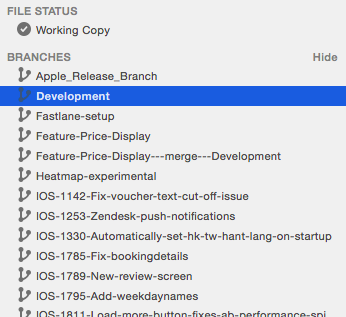
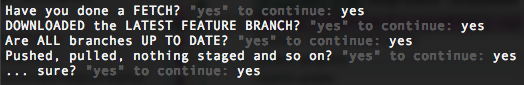
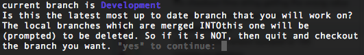
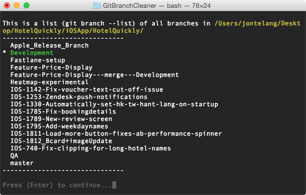
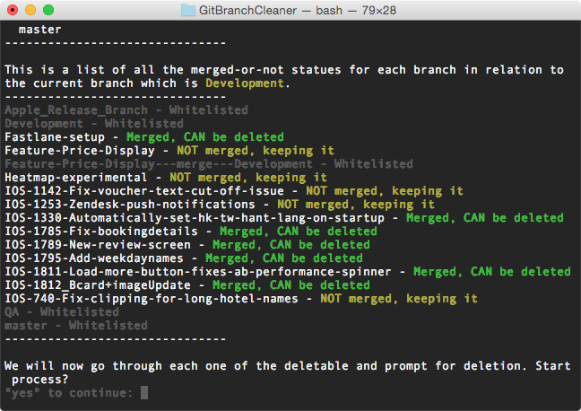
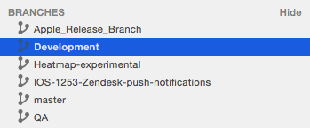

## Script quality

Solid in use but not the most readable, let me know if you have some questions about it.

## Use case

You have loads of branches and you don't want to manually delete them.

## What will happen

1. The script will remind you to do you FETCHes, PULLs and such items  
2. It will list all branches   
3. It will see if each branch is merged into the `CURRENT BRANCH`  
 -- Let's say you have `MASTER`, `FEATURE_1`, `_2` and `_3`  
 -- `_1` and `_2` have passed code review but `_3` is still there  
 -- git will then see that (assuming `MASTER` is the `CURRENT BRANCH`) `_1` and `_2` are merged into `MASTER`  
4. The branches that are merged, it will prompt for removal or to keep them  
 -- Some keywords are whitelisted, such as QA, Development, Apple, Release  

## How it looks like in action

**Loads of branches**  
  

**First we go to the right folder**  
  

**The sanity checking** (it has saved me lots of times actually)  
  

**Letting you know the current branch**  
  

**Just a list of all branches, for informational purposes**  
  

**This is also just a list, but run through git to see if they are merged into the current branch**  
  

**How it looks like when we delete or keep a branch**  
  

**After manually deleting some remaining branches, we're all done. And in under 1 minute.**  
  
