From the script itself:

## Use case

You are in the middle of coding and QA wants new stuff that are on development branch. Example after a pull request was merged. This script will then save your current state (stash+current branch), checkout and pull development branch so that you're up to date from origin, do the same for qa branch (pull origin), then merge the new stuff from development branch into the qa branch and push it up. Then it will restore your state (stash+branch). All in less than 30 seconds.

## What will happen

In this example I've set the following vars

`BRANCH_TO_MERGE_FROM` = Development-branch  
`BRANCH_TO_MERGE_INTO` = QA-branch  
`REPO_DIR` = /dir/to/repo

1. CD to your project folder (`/dir/to/repo`)
2. Stash any temporary work in a new stash
2.5 Save the current branch name (so we can go back automatically)
3. Checkout `Development-branch` branch
4. Pull `Development-branch` branch to ensure up-to-dateness
5. Checkout `QA-branch` branch
6. Pull `QA-branch` branch to ensure up-to-dateness
7. Merge `Development-branch` INTO `QA-branch`
8. Push `QA-branch` to origin/`QA-branch`
9. Checkout the previous/saved/working branch from step 2.5
10. Apply the saved stash

## How it looks like

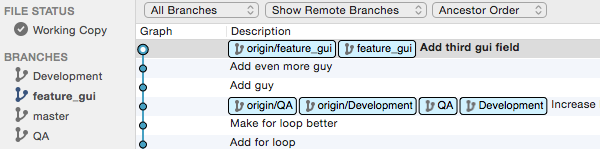  
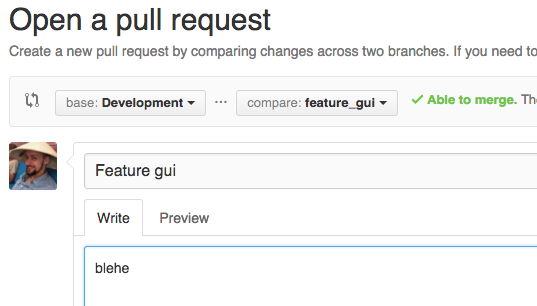  
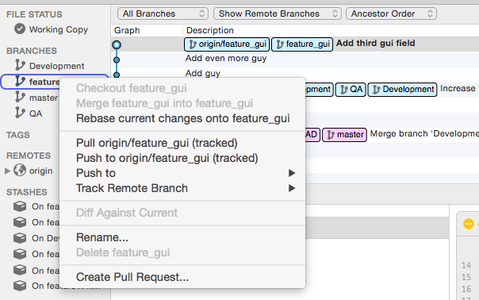  
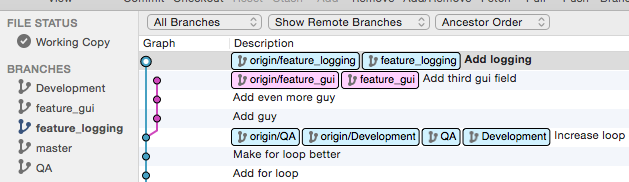  
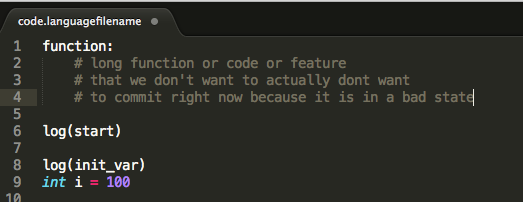  
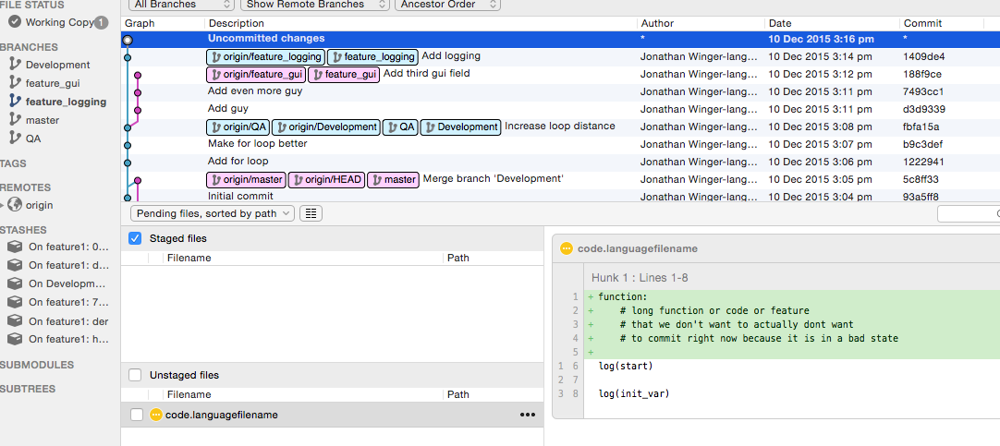  
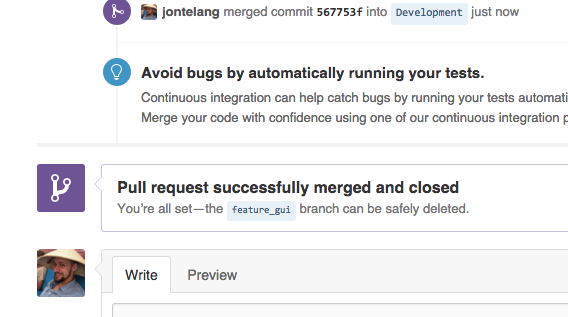  
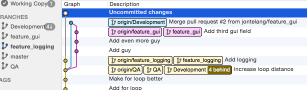  
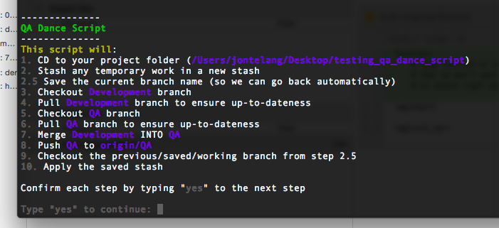  
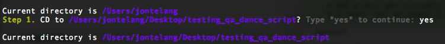  
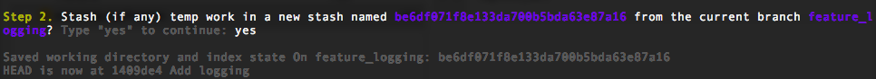  
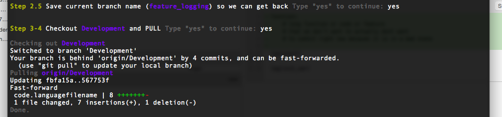  
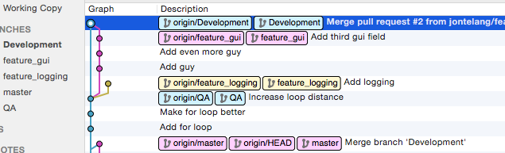  
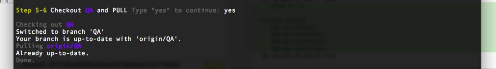  
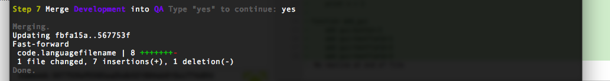  
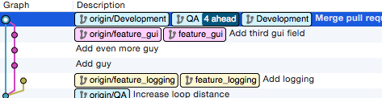  
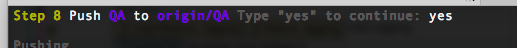  
  
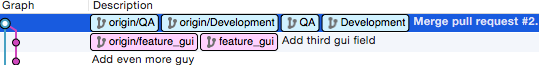  
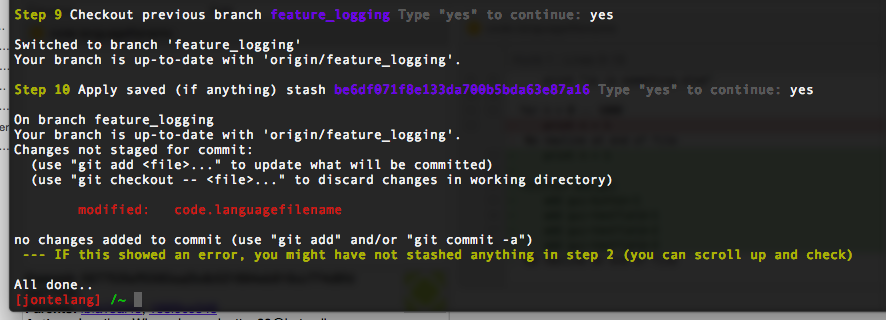  
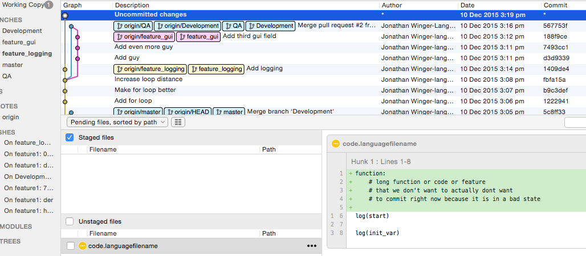  
