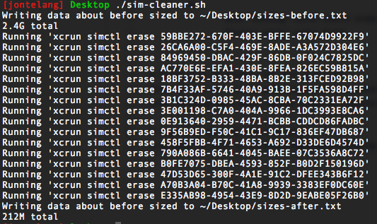

This script will loop through all of your xcode simulators and run the apple tools to erase their content.
  
If you have multiple Xcode versions installed, some simulators will not be cleaned. You will need to change the "active" command line tools from within Xcode (or via xcode-select). After changing, just re-run the script.

Example output

